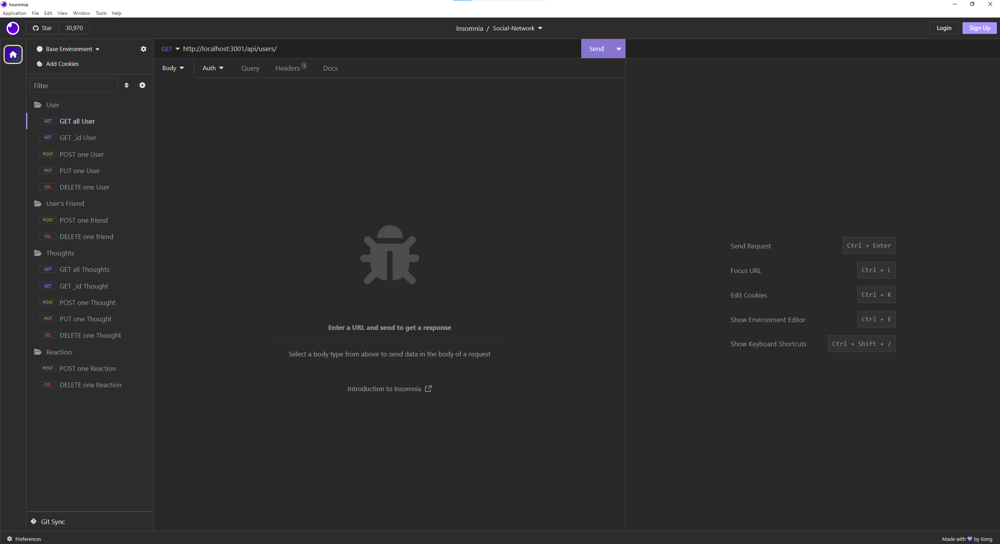
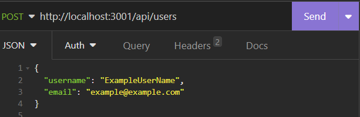
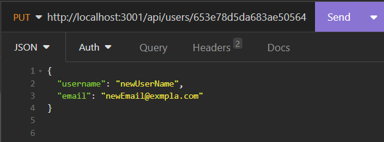
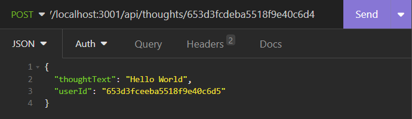

# <Your-Project-Title>Social-Network-API

## Description [](https://opensource.org/licenses/MIT)

- What was your motivation?

        To build an back-end system to for users to interact with their thoughts

- What problem does it solve?

         Convenience for a social-media owner to track and manage the users and their thoughts and reactions.

- What did you learn?

        Mongoose models setup/relationship, and its routes and controller

## Table of Contents

- [Installation](#installation)
- [Usage](#usage)
  - [Users](#users)
  - [Friends](#friends)
  - [Thoughts](#thoughts)
  - [Reactions](#reactions)
- [Credits](#credits)
- [License](#license-and-badges)
- [Additional Info](#additional-infomation)

## Installation

Run in integrated terminal with the command

- To start the server

```
    npm start
```

## Usage

After starting the server, use [**Insomnia**](https://insomnia.rest/download) app



With the app, a user can **create, read, update, delete** in users, thoughts and reaction section.

### Users

[**Thoughts**](#thoughts) || [**Reactions**](#reactions)

- To **READ/retrieve ALL** existing Users, use **GET** request with the end point

```
http://localhost:3001/api/users
```

- To **READ ONE** specific User, use **GET** request and replace the "**_`_id`_**" with its associated \_id number

```
http://localhost:3001/api/users/_id

example: to read the user with id number of 653d3fceeba5518f9e40c6d5, use
 http://localhost:3001/api/users/653d3fceeba5518f9e40c6d5
```

- To **CREATE** a new user, use **POST** request and with the end point, replace "**_`ExampleUserName`_**" in the body with your desired name



```
http://localhost:3001/api/users
```

```json
{
  "username": "New Username",
  "email": "newuser@example.com"
}
```

- To **UPDATE** an existing user/email, use **PUT** request and replace the "**_`_id`_**" with its associated \_id number

```
http://localhost:3001/api/categories/_id

example: to update the name of user with id number of 653d3fceeba5518f9e40c6d5, use
 http://localhost:3001/api/users/653d3fceeba5518f9e40c6d5
```

In the body, replace "**_`newUserName`_**" and/or "**_`newEmail@exampla.com`_**" and with your desired name/email and click send.



```json
{
  "username": "NnewUserName",
  "email": "newEmail@exampla.com"
}
```

- To **DELETE** an existing user, use **DELETE** request replace the "**_`_id`_**" with its associated \_id number
- note all thoughts associated to the user will be deleted upon the delection of that user

```
http://localhost:3001/api/users/_id

example: to delete the name of users with id number of 653d3fceeba5518f9e40c6d5, use
http://localhost:3001/api/users/653d3fceeba5518f9e40c6d5

```

### Friends

- To **CREATE** a friend to a user, use **POST** request and with the end point, replace "**_`user_Id`_**" and "**_`friend_Id`_**"

  Both need to be existing users in the database, and so the friend_id will be added to the user_id as friend of the user.

      http://localhost:3001/api/users/user_Id/friends/friend_Id

- To **DELETE** a existing friend from a user, use **DELETE** request replace "**_`user_Id`_**" and "**_`friend_Id`_**"

  Both need to be existing users in the database, and so the friend_id will be removed from the user_id as un-friend to the user.

      http://localhost:3001/api/users/user_Id/friends/friend_Id

### Thoughts

[**Users**](#users) || [**Reactions**](#reactions)

- **READ/DELETE** please refer [**Users**](#users) section, and end points for thoughts are

> **READ ALL** http://localhost:3001/api/thoughts

> **READ ONE** http://localhost:3001/api/thoughts/`_id`

> **DELETE** http://localhost:3001/api/thoughts/`_id`

- **CREATE** a new one thought with **POST** request, the end point is

```

http://localhost:3001/api/thoughts

```

In the body, please

- Replace `InputTextHere` with your desired text thought
- Replace `existingUser_id` with an \_id number, for example 653d3fceeba5518f9e40c6d5 we have used in previous examples

```json
{
  "thoughtText": "InputTextHere",
  "userId": "existingUser_id"
}
```

Example of creating a new thought with thoughtText **Hello World** that is from User \_id **653d3fceeba5518f9e40c6d5**



- To **UPDATE** an existing thought, use **PUT** request and replace the "**_`thought_id`_**" with its associated id number

```
http://localhost:3001/api/thought/thought_id
```

and update the information about the thoughtText as the body format, replace `input update text here`

```json
{
  "thoughtText": "input update text here"
}
```

### Reactions

[**Users**](#users) || [**Thoughts**](#thoughts)

- **DELETE** please refer [**Users**](#users) section, end points are

> **DELETE** http://localhost:3001/api/thoughts/`thought_id`/reactions/`reaction_id`

- **CREATE** a new one reaction with **POST** request, the end point is

```
http://localhost:3001/api/thoughts/:thought_id/reactions
```

In the body, replace `reaction input text` with your desired input text

```json
{
  "reactionBody": "reaction input text"
}
```

## Credits

Class REPO examples, and Wayne

## License-and-Badges

[](https://opensource.org/licenses/MIT)

---

## Features

Back-end social-network management system

## Tests

none

## Additional-Infomation

Github: https://github.com/wayne80361

Email: wayne80361@gmail.com

REPO LINK: https://github.com/wayne80361/Social-Network-API-Wayne

- First Video show over all funcationality of the API:
  Video Link 1: https://drive.google.com/file/d/1_zjAO9pDIAHVN9al5ex4UuediQ2w9jp3/view

- Second Video show deleting a User will delete the thoughts associated to the User:
  Video Link 2: https://drive.google.com/file/d/1v5QO60oW1EiTZQ2Q9Oj1sZVWNtcW7aoo/view
